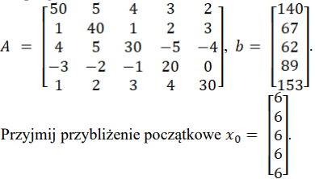

# Laboratorium 7
Napisz program w języku „C/C++”, rozwiązujący układ czterech równań liniowych metodami
iteracyjnymi: (a) Jacobiego, (b) Gaussa-Seidela, (c) SOR z parametrem  = 1/2, a następnie zastosuj
ten program do rozwiązania układu równań liniowych Ax = b, gdzie

Zastosuj trzy niezależne kryteria zakończenia iteracji. Zadbaj o to, aby wyprowadzać na konsolę
wyniki pośrednie obliczeń dla każdej iteracji, tak aby możliwe było obserwowanie zbieżności
kolejnych przybliżeń pierwiastków i porównanie liczby iteracji niezbędnych do uzyskania (za
pomocą różnych metod) rozwiązania o zadanej dokładności bezwzględnej. W szczególności oblicz
jak zmienia się estymator błędu rozwiązania oraz residuum układu w trakcie kolejnych iteracji.